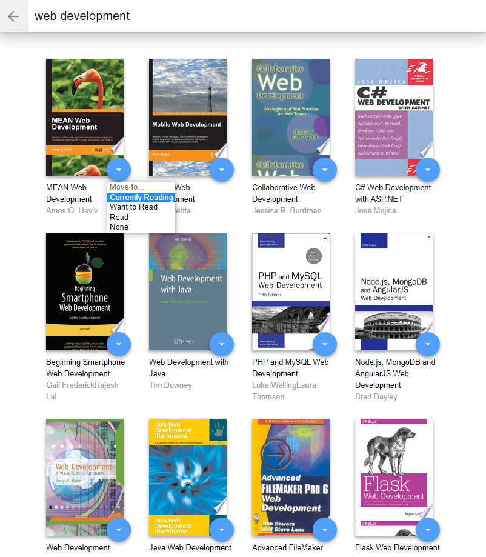
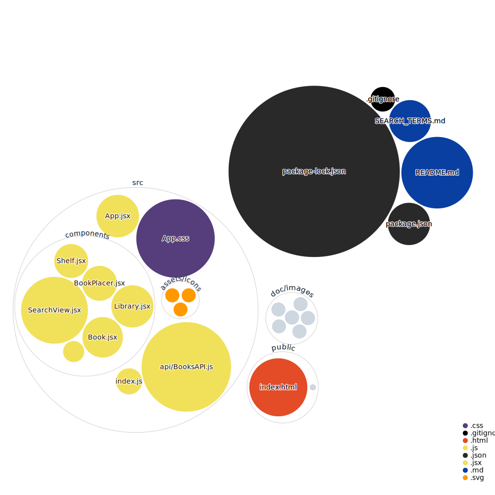

# MyReads: A Book Tracking App

[](https://app.netlify.com/sites/myreadslib/deploys)

## 📄 About MyReads

Track and organize your books now with elegance and ease. MyReads lets you organize the books you have to their corresponding virtual shelves.

👉[Try live demo](https://myreadslib.netlify.app/)

To get started and try it locally, all you need to do:

  - Clone this project
  - install all project dependencies with `npm install`
  - start the development server with `npm start`

## 🔮 Technologies
This application was made using this wonderful technologies:

&nbsp;
<div align="center">


</div>
&nbsp;

## Screenshots




## 🏛 Architecture



## Backend Server

To simplify your development process, we've provided a backend server for you to develop against. The provided file [`BooksAPI.js`](src/BooksAPI.js) contains the methods you will need to perform necessary operations on the backend:

* [`getAll`](#getall)
* [`update`](#update)
* [`search`](#search)

### `getAll`

Method Signature:

```js
getAll()
```

* Returns a Promise which resolves to a JSON object containing a collection of book objects.
* This collection represents the books currently in the bookshelves in your app.

### `update`

Method Signature:

```js
update(book, shelf)
```

* book: `<Object>` containing at minimum an `id` attribute
* shelf: `<String>` contains one of ["wantToRead", "currentlyReading", "read"]  
* Returns a Promise which resolves to a JSON object containing the response data of the POST request

### `search`

Method Signature:

```js
search(query)
```

* query: `<String>`
* Returns a Promise which resolves to a JSON object containing a collection of a maximum of 20 book objects.
* These books do not know which shelf they are on. They are raw results only. You'll need to make sure that books have the correct state while on the search page.

## Note
The backend API uses a fixed set of cached search results and is limited to a particular set of search terms, which can be found in [SEARCH_TERMS.md](SEARCH_TERMS.md). That list of terms are the _only_ terms that will work with the backend, so don't be surprised if your searches for Basket Weaving or Bubble Wrap don't come back with any results.
